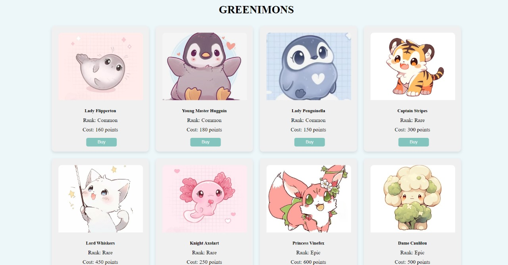

# GreeniMi 

## Team Information
- **Suchitra M** : Worked on Game GUI and frontend for main website, video editing
- **Tasneem I**: worked on Game development, web distribution creation, deployment, frontend and backend of main website
- **Trisheta S** : Worked on Game Asset Creation, Processing and Formatting, Game Development, Frontend development for main website, PPT creation
- **Thejuswini R** : Worked on Game Asset Creation, Processing and Formatting, Game Development, Frontend development for main website, PPT creation

## How to Use 
1. Clone Github Repository
2. Check if you have python installed. If not, install python
3. Go to command prompt and change sirectory to the cloned repository folder and enter `pip install requirements.txt`
4. Open with a code editor like VSCode
5. Open `app.py` file
6. Click on run, where you will see a server link like 125.0.0 in the terminal
7. Click on the link and check out the website
## Images 

Sign Up
 

Log In
 

Monster Shop
 
 

Tracker
 
 
 

Game 

Game Link: https://tasneem-i.itch.io/greenimi
 
 
 

## Inspiration
GreeniMi was born from the ideology of reward based gamification. Now, there is a rising awareness of what climate change is and the responsibilities associated with it. There are also certain resources to help people make more sustainable decisions. But often times, the roadmap is soon abandoned. This, we feel, is mainly tied with the fast paced lifestyle where everyone expects instant rewards

GreeniMi is our effort to build a platform to provide instant extrinsic rewards to motivate users to stick to their sustainability goals. And if the current reward system begins to lose novelty? We have multiple plans in place to bring other features to keep users loyal to their goal. Finally users start to realize the intrinsic drive to be a sustainable person and there is no more need for rewards, effectively becoming a sustainable person

## What it does
GreeniMi is a web based app solution and has two major components:
- A visual novel game designed to cater to young audiences aged between 6-14 to help them learn to make sustainable decisions and consider sustainability as a metric in the decisions they make. 
- The second component is a tracker geared towards teen and older age groups to help change their lifestyle - one quest at a time. The tracker has an overall quests tab from which users can choose to add them as their own quest. When they complete a quest, they are rewarded with earth points. These quests are small sustainable actions one can take to reduce their carbon footprint. The points can be exchanged for GreeniMons from the Monshop page. 

## How we built it
 We first focused on our problem statement : individual sustainability. We then researched on why even with awareness, many fail to reduce their carbon footprint. We also delved into user psychology and recent trends to come up with a suitable solution to help users stay true to their goals. Finally, we decided to make use of a simpler tech stack to facilitate easy of use and build. 

The backend of the website was built using flask and sqlite3. The front end made use of HTML, CSS, JavaScript and Bootstrap. The game is made using Ren'Py with images and audios generated from Text to Speech APIs and Stable Diffusion Models. 

## Challenges we ran into
As beginners, we faced challenges due to our limited experience in building and deploying games. However, we managed to build a basic game which makes each and everyone understand what Sustainability is. 

While we managed to handle some basic backend tasks, due to our limited knowledge in backend development and database management we were not able to completely develop the backend framework. However, these obstacles provided valuable learning opportunities and helped us grow our skills significantly.

## What we learned
We developed skills in problem understanding, selecting, and solving complex issues. Our knowledge of climate change was deepened, allowing us to comprehend various issues and their global impacts. We learned to formulate diverse game choices and analyze the implications of each decision on climate change. Additionally, we acquired the ability to build and maintain a stable web application, and we explored the processes involved in developing and deploying a visual novel.

## What's next for Greeni-Mi
We would like to develop the prototype such that, when user reaches a certain minimum criteria for sustainability quest completion, **leaderboards** are introduced- both for earth points and for GreeniMons owned. 

After user buys a minimum number of GreeniMons, **Monster Battle Arena** is unlocked where users can battle against each other with their pet monsters. They can only battle with passes which is achieved when they complete a sustainability quest or when they buy it with points. 

When user buys more GreeniMons Or reaches a particular ranking in the Arena, **world stories** are unlocked. These are different story scrolls carrying the legends of the monster world and can only be unlocked by completion sustainability quests. 

Apart from these, we plan to increase our database of quests, GreeniMons as well as increase game scenes for our Eco Play game. 
